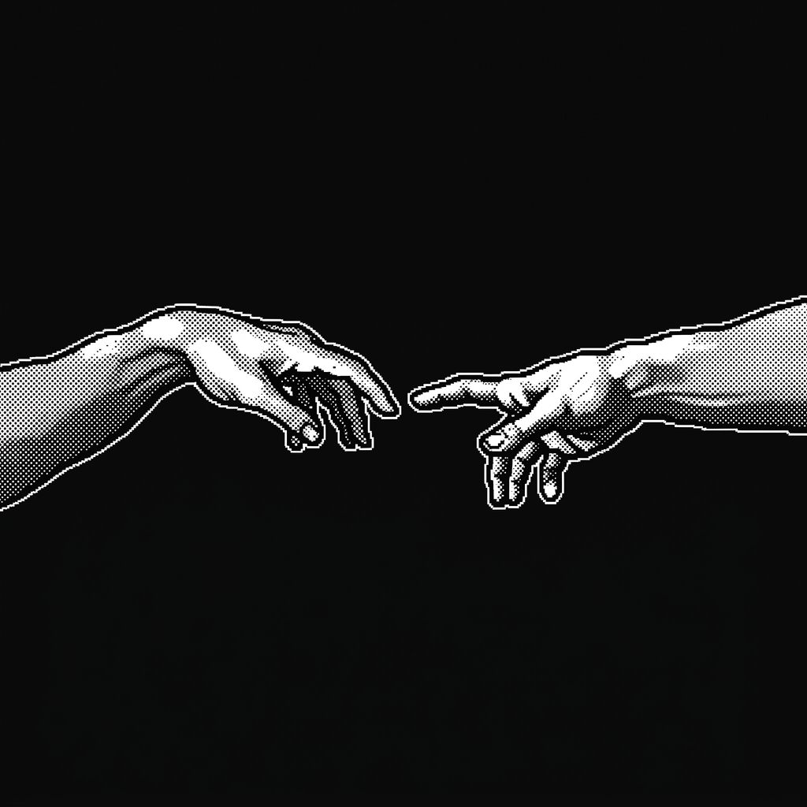

# 🌌 Hey, It's Praveen here

  

  <strong>I like building things that make sense. I work in empty space.</strong>

---

### 💫 About Me

- 🎧 **Vibing to beats** | Github feels like home.
- 🎓 **Education:** Exploring deep tech, system design, and database architectures.
- 🛠️ **Current Focus:** Building responsive full-stack applications & game engines.
- 📍 **Location:** Hogwarts / Delulu (or Chennai, India 🇮🇳)

---

### 🛠️ Tech Stack & Tools

  
  
  
  
  
  

---

### 📊 GitHub Stats

  
  

  

---

### 🤝 Connect with me

  
  

